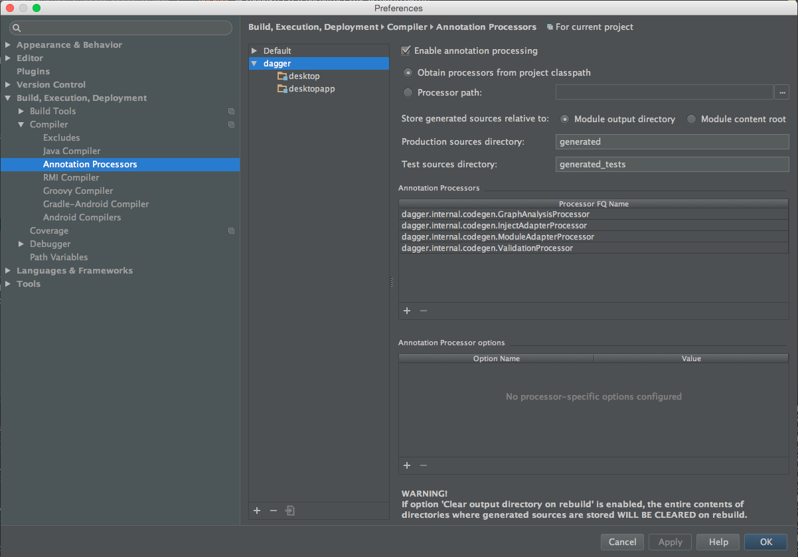

#CleanContacts

Clean contacts is a sample repository to illustrate Clean architecture in Android. It has also many other details that hopefully will be useful too.

##Speak
I gave a talk in Salamanca (Spain) about this implementation, here is the video: [Spanish] (https://www.youtube.com/watch?v=Co8bJq_zbSQ&t=46m42s)

Slides:
[Spanish] (http://es.slideshare.net/ChristianPanadero/my-way-to-clean-android-android-day-salamanca-edition), [English] (http://es.slideshare.net/ChristianPanadero/my-way-to-clean-android-android-day-salamanca-edition-45930288)

##How to start with this repository
The project is divided in 5 modules:

* App (Android): Contains UI, Dependency injection (Configuration) and implementation details of some figures like the Bus and Invoker.
* Presentation (Java): Contains presenters of (MVP) and the contract (View interface) to comunicate with.
* Domain (Java): Contains Interactors and bussines logic
* Repository (Java): Basic [repository](http://martinfowler.com/eaaCatalog/repository.html) implementation. It handles the data sources and knows when to choose network/bdd.
* Data (Android): Data sources implementation (network, bdd, shared prefs...)
* **Bonus:** Desktop. Using the logic of this app and re-implementation details (App module and data module) I re-used code to create a JavaFX implementation of the first screen to show a contact list

##Things that you can find useful

###MVP
Model View presenter implemented in 2 modules. The Java module does not uses dependencies with the framework as R.string etc... 

###Navigation via ActionCommands
This is an idea of [Pedrovgs](https://github.com/pedrovgs/EffectiveAndroidUI), create small classes named "ActionCommands" that are used to navigate between activities, you can find this implementation in "DetailActionCommand"

###Minimal repository
You can find a [repository](http://martinfowler.com/eaaCatalog/repository.html) implementation in the "repository" module. Is just  the part that allows to discriminate the data source. If I need to use other implementation for network/bdd I will only change the data source imp.

###Use of abstractions
You can find some examples like ImageLoader or ErrorManager interfaces that are implemented by PicassoImageLoader and SnackBarErrorManager, this will allow to change the implementations in the future to use different ways to show images / show errors. Allways you can do it, use an Abstractions instead of a concrete implementation.

###Caching Strategy
In the BDD data source you can find a Caching Strategy (CS). The CS is a common logic to all data "CachingDataSources" and is a configuration of the data source so I added a constructor parameter with this collaborator to configure externally. Currently I added 2 implementations of CS, TTL (Time To Live) and NullSafe (just for check if is null) so the datasource requests data and checks if the objects are valid. If the objects are not valid the datasource throws a "InvalidCacheException" and repo handles the Exception and requests data to the next data source if needed.

###Material transitions and picasso loading
In the contact list you, when you tap a contact you will navigate to Detail. In the contact list you have a thumbnail of the contact pic. When navigating to DetailActivity the image is a shared element that will move/scale to the Detail position that will later load a large picture.

###Coordinator to avoid flags

[Coordinator](http://panavtec.me/presentando-coodinator-o-como-evitar-flags/) is a simple class utility that will help you to avoid flags, you will see in action in DetailActivity, it needs to coordinate the transition of the Main > Detail and the load from the BDD to show the contact.

###Assisted injection
This repo contains implementation for Android > 5 and < 5 (that just do nothing), For resolve this in Dagger I followed the tip of [Jesse Wilson](https://groups.google.com/forum/#!topic/dagger-discuss/QgnvmZ-dH9c/discussion) you can see the implementation in ActivityModule.

###Desktop app sharing common modules
I created a sample desktop app using JavaFX sharing presentation, domain/entities and repository modules. Just re-implementing the data sources and the UI module wich are implementation details. You can find the desktop app in the folder "desktop". If you are using IntelliJ and you want to run the sample, you will need this configuration:

